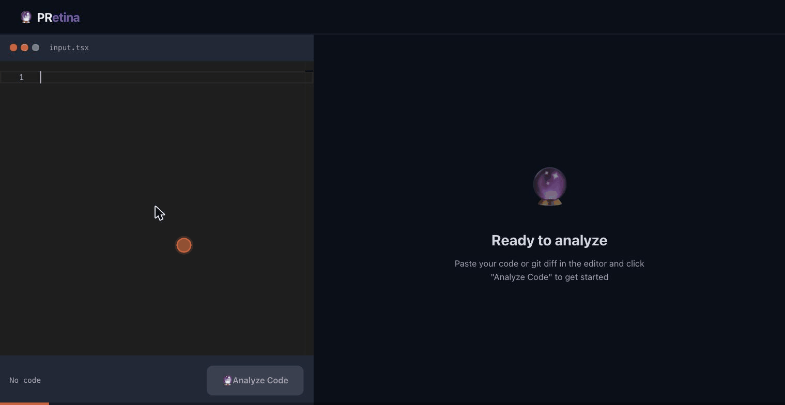

<p align="center">
  
  
  
  
  
</p>

<h1 align="center">🔮 PRetina</h1>
<p align="center"><strong>AI-powered code review for frontend teams</strong></p>
<p align="center">
  Catch Design System violations · Accessibility issues · Generate PR docs — instantly
</p>
<p align="center">
  <a href="https://pretina-ai.vercel.app"><strong>→ pretina-ai.vercel.app</strong></a>
</p>

---



---

## What it does

- 🎨 **Detects Design System violations** — hardcoded colors, spacing, typography, border radius that bypass design tokens
- ♿ **Catches accessibility bugs** — missing ARIA labels, broken focus management, keyboard navigation gaps (WCAG 2.1)
- 📄 **Generates PR documentation** — paste a git diff, get a professional PR summary + per-file breakdown ready to copy as GitHub Markdown

---

## Tech Stack

| Layer | Technology |
|---|---|
| Framework | Next.js 16 App Router · React 19 |
| AI | Gemini 2.5 Flash via `@ai-sdk/google` v3 + `generateObject` + Zod schema |
| Editor | Monaco Editor (`@monaco-editor/react`) — TypeScript & diff syntax |
| Styling | CSS custom properties (design tokens) · inline styles |
| Deployment | Vercel (Fluid Compute, 60s max duration) |
| Language | TypeScript (strict) |

---

## Features

### Design System Rules
| Code | Rule |
|---|---|
| DS001 | Hardcoded spacing |
| DS002 | Hardcoded color |
| DS003 | Hardcoded typography |
| DS004 | Hardcoded border radius |
| DS005 | Missing semantic token |
| DS006 | Inconsistent naming |

### Accessibility Rules
| Code | Rule | WCAG |
|---|---|---|
| A11Y001 | Missing accessible name | 4.1.2 |
| A11Y002 | Missing focus management | 2.4.3 |
| A11Y003 | Missing ARIA role | 4.1.2 |
| A11Y004 | Color-only indicator | 1.4.1 |
| A11Y005 | Keyboard navigation missing | 2.1.1 |
| A11Y006 | Missing alt text | 1.1.1 |

### Analysis Modes
- **Single File** — paste any component, get instant DS + A11y review
- **Git Diff** — paste a full PR diff, get per-file analysis + merged stats + PR summary

### UX Details
- Collapsible `IssueCard` — click to expand fix details
- Filename chip (`⎘ Button.tsx:4`) — click to copy full path for CMD+P in IDE
- Rate limit countdown UI — shows retry timer when Gemini quota is hit
- WAI-ARIA tabs with arrow key navigation
- Copy full report as GitHub Markdown in one click

---

## Architecture

```
/app
  page.tsx          ← Landing page (/)
  /app
    page.tsx        ← Tool UI (/app) — Monaco editor + analysis panel
  /api/analyze
    route.ts        ← POST /api/analyze — Gemini API orchestration

/lib
  parseDiff.ts      ← Parses git diff text → per-file hunks, filters frontend files
  mergeResults.ts   ← Merges per-file AI results, injects filename into violations
  mockResult.ts     ← MOCK_API=true bypass for dev (no quota used)
```

**Diff mode flow:**
```
POST /api/analyze { code: diffText, mode: "diff" }
  → parseDiff()           parse diff → ParsedFile[]
  → getRelevantFiles()    filter .tsx/.ts/.css etc.
  → Promise.all()         parallel Gemini call per file
  → PR_SUMMARY_PROMPT     one final call for overall PR summary
  → mergeResults()        flatten violations, inject filename
  → Response.json()
```

**Error handling:**
- `429` Rate limit → returns `{ retryAfter: seconds }` → client shows countdown
- `503` Overload → exponential backoff (up to 3 retries, server-side)
- `maxRetries: 0` on `generateObject` — disables AI SDK built-in retry to surface real errors

---

## Local Setup

```bash
git clone https://github.com/Nattapan-T/prizm.git
cd prizm
pnpm install
```

Create `.env.local`:
```env
GOOGLE_GENERATIVE_AI_API_KEY=your_key_here
MOCK_API=false   # set true to skip API calls during dev
```

```bash
pnpm dev
```

Open [localhost:3000](http://localhost:3000) — landing page  
Open [localhost:3000/app](http://localhost:3000/app) — tool

> Get a free Gemini API key at [aistudio.google.com](https://aistudio.google.com)

---

## Live Demo

**[pretina-ai.vercel.app](https://pretina-ai.vercel.app)**

Try with this sample diff:

<details>
<summary>Sample git diff to paste</summary>

```diff
diff --git a/src/components/Button.tsx b/src/components/Button.tsx
index a1b2c3d..e4f5g6h 100644
--- a/src/components/Button.tsx
+++ b/src/components/Button.tsx
@@ -1,8 +1,12 @@
 import React from 'react'
 
-export function Button({ children }) {
+export function Button({ children, onClick }) {
   return (
-    <button>
+    <button
+      onClick={onClick}
+      style={{ backgroundColor: '#1A73E8', padding: '13px 24px', fontSize: '16px' }}
+    >
       {children}
     </button>
   )
 }
diff --git a/src/components/Modal.tsx b/src/components/Modal.tsx
index 1234567..abcdefg 100644
--- a/src/components/Modal.tsx
+++ b/src/components/Modal.tsx
@@ -1,10 +1,16 @@
 import React from 'react'
 
-export function Modal({ onClose }) {
+export function Modal({ onClose, children }) {
   return (
-    <div>
-      <button onClick={onClose}>×</button>
+    <div style={{ position: 'fixed', inset: 0, background: 'rgba(0,0,0,0.5)' }}
+      onClick={onClose}
+    >
+      <div style={{ background: '#ffffff', borderRadius: '12px', padding: '24px' }}>
+        <button onClick={onClose}>×</button>
+        {children}
+      </div>
     </div>
   )
 }
```

</details>

---

<p align="center">
  Built with Next.js · Gemini 2.5 Flash · Open Source
  <br/>
  <a href="https://pretina-ai.vercel.app">pretina-ai.vercel.app</a>
</p>
